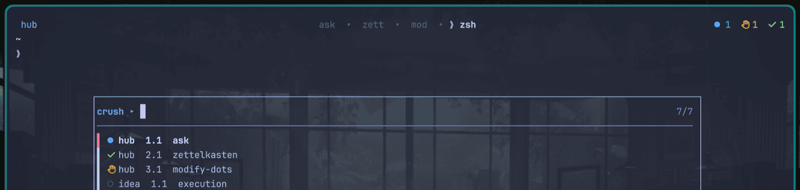

# crush-tmux

[Crush](https://github.com/charmbracelet/crush) management for tmux. Manage multiple Crush instances with at-a-glance status indicators and fast instance switching.



Built for a dotbar-themed tmux that owns only the (otherwise empty) `status-right` and never touches the theme.

## Why

Multi-agent attention management tools (agent-deck, ccmux, tmux-agent-status,
tmux-agent-indicator) are all driven by Claude Code / Codex lifecycle hooks
(`Stop`, `Notification`, `PermissionRequest`). Crush v0.88 exposes only
`PreToolUse` hooks, so it cannot feed them — they would show Crush as forever
"running". agent-deck additionally runs agents in an isolated `tmux -L
agent-deck` server, which stomps a themed status bar in your default server.

This instead reads what Crush actually is:

1. **Which instances exist** — process discovery: map each `crush` process TTY
   to a tmux pane (`ps` + `tmux list-panes`).
2. **How far along it is** — **read-only DB watermarking** against the
   per-project `<cwd>/.crush/crush.db`. Watermark = `MAX(messages.created_at)`.
   Combined with the footer scan to tell busy from idle.
3. **Is it blocked** — a footer scan for the `Allow/Deny` permission barrier
   (and `Requesting permission...`), the one thing the DB cannot see.


## Install

```sh
go install github.com/soyomarvaldezg/crush-tmux@latest
```

Then in `~/.config/tmux/tmux.conf` (after TPM + theme overrides):

```tmux
set -g focus-events on
set -g status-right "#(/path/to/crush-tmux status)"
set -g status-right-length 120
set -g status-interval 2

set-hook -g after-select-pane      'run-shell -b "/path/to/crush-tmux mark-viewed"'
set-hook -g after-select-window    'run-shell -b "/path/to/crush-tmux mark-viewed"'
set-hook -g client-session-changed 'run-shell -b "/path/to/crush-tmux mark-viewed"'
set-hook -g client-focus-in        'run-shell -b "/path/to/crush-tmux mark-viewed"'

bind-key a display-popup -E -w 80% -h 60% "/path/to/crush-switcher.sh"
```

## States (attention-only)

The bar shows only what needs you, as **collapsed counts**, so it never grows
past three short segments regardless of how many agents you run. The status
bar segment reads e.g. `● 1  ✋ 2  ✓ 1`.

| glyph | color | state | meaning |
|---|---|---|---|
| `●` N | blue | working | N agents mid-task (footer spinner or ambiguous footer + watermark advancing) |
| `✋` N | orange | blocked | N agents waiting on your Allow/Deny |
| `✓` N | green | done | N agents finished, you haven't looked yet |

When nothing needs attention, the bar reads `· crush idle`.

The **focused pane is excluded** from the bar entirely: if you're already
looking at an agent, there is nothing to draw your attention to. You can see
per-pane state (including `○` seen, grey) in the switcher popup.

| glyph | color | where | meaning |
|---|---|---|---|
| `○` | grey | switcher only | idle / already seen / first sighting |

Agent labels in the switcher are **tmux session names** (matching what you see
in the tab bar), with window.pane location and project folder name.

## Classification (priority order)

For each pane, the last 15 raw lines are captured once (`scanFooter`):

1. **Blocked** wins over everything: footer contains `Allow for Session`, or
   `Allow`+`Deny`+`choose` (the dialog box), or `Requesting permission...`.
   The string `Requesting permission...` persists longer than the dialog box,
   which can scroll above the scan window while it waits.
2. **Working via footer**: a line matching the animated spinner — a `> ` prefix
   with a `...` suffix (e.g. `> Working!`, `> Brrrrr...`, `> Thinking...`), or
   literally `> Working!`. These are absent from the idle footer.
   `esc cancel` and `Waiting for tool response` are **not** used: they appear
   in the idle footer / linger in scrollback and would misclassify idle or
   blocked panes as working.
3. **Watermark + footer idle**: watermark moved past the stored value.
   - footer explicitly idle (`tab focus chat` / `tab focus editor`) → **done**
     (finished, unseen). A higher watermark just means output arrived earlier.
   - footer ambiguous (neither working, idle, nor blocked, e.g. frozen frame)
     → **working**.
4. **Stable watermark** → done if unseen, seen if already viewed.

Lanes are keyed by **project cwd** (not session name) so several panes in one
tmux session working on different projects don't collide on a single watermark.

## Read-only guarantee

The DB is opened with `file:<path>?mode=ro&_query_only=true` (see `db.go`).
`mode=ro` makes writes fail at the driver; `_query_only=true` makes SQLite
itself refuse any write or state-changing pragma. The binary therefore
**cannot** write to a crush database — read-only is enforced at open, not by
convention. Readers never block Crush's writer, so there is no concurrency or
latency impact.

## Subcommands

- `crush-tmux status` — render the status-right segment (called by tmux every
  `status-interval`). Excludes the focused pane; prints collapsed counts.
- `crush-tmux switch` — print fzf rows (`paneID<TAB>glyph session loc project`);
  consumed by `crush-switcher.sh`. Shows every live pane including the focused
  one and seen (`○`) ones.
- `crush-tmux mark-viewed` — focus hook; collapses done→seen for the focused
  pane's project lane.

State persists in `~/.config/tmux/crush/crush-tmux-state.json` so the done/seen
distinction survives across ticks.

## Maintenance

- **tmux updates**: safe. Uses only stable, long-standing tmux surface
  (`list-panes`, `capture-pane`, `display-message`, `set-hook`, `status-right`).
- **Crush updates**: the fragile points are the footer strings at the top of
  `state.go`:
  - `isBlocked` — `Allow for Session`, `Allow`+`Deny`+`choose`, `Requesting
    permission...`. If a release rewords the permission prompt, update these.
  - `isWorkingFooter` — the `> …` spinner-prefix rule. If animation changes,
    update this.
  - `isIdleFooter` — `tab focus chat` / `tab focus editor`.
  The done/working distinction is watermark based and does not depend
  on footer wording. When a marker drifts: `tmux capture-pane -p -J -t <pane> |
  tail -15`, update the matching function in `state.go`, rebuild, `tmux
  refresh-client -S`.

## Troubleshooting

- **Bar shows `· crush idle` but panes look like Crush**: discovery keys off
  live `crush` processes (`ps -Ao tty,command`), not screen content. A pane
  showing a frozen Crush frame after the instance exited (e.g. after a `crush
  update` that restarted it) has no process on its TTY and is correctly
  invisible. Check with `tmux list-panes -a -F
  '#{pane_current_command} #{pane_tty}'` — only panes whose current command is
  `crush` count.
- **Labels look wrong**: the switcher/badge label is the tmux session name;
  the project folder name is shown separately in the switcher rows.
